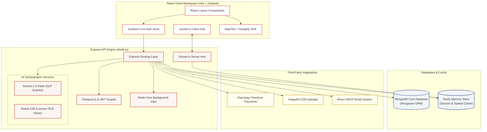
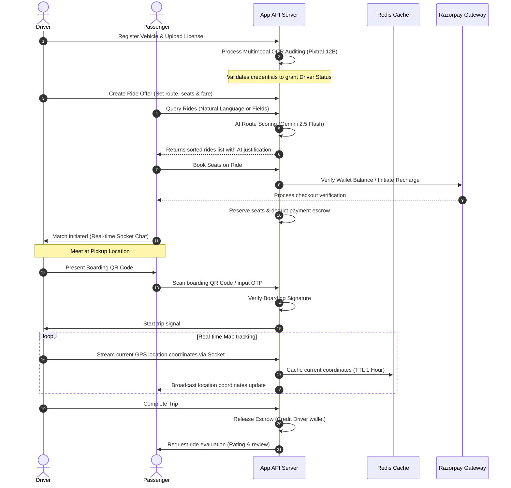

<div align="center">

# 🚗 ODOO CARPOOLING PLATFORM
### *Enterprise-Grade Autonomous Ride Sharing System*

[](https://react.dev/)
[](https://nodejs.org/)
[](https://www.mongodb.com/)
[](https://redis.io/)
[](https://deepmind.google/technologies/gemini/)
[](https://mistral.ai/)

<p align="center">
  <b>A comprehensive, high-security carpooling and ride-sharing ecosystem customized for large corporate networks. Features smart AI route matching, automated driver license auditing, live socket-based map tracking, and integrated Razorpay wallet systems.</b>
</p>

---

[⚡ Features Showcase](#-key-features-showcase) • [🧱 System Architecture](#-system-architecture) • [🔀 Trip Lifecycle Flow](#-trip-lifecycle-sequence) • [💾 Database Schema](#-database-relationships) • [🤖 Under the Hood (AI Core)](#-under-the-hood-ai--vision-showcase) • [📡 WebSockets](#-websocket-event-schema) • [🚀 Getting Started](#-getting-started) • [🔒 Security Controls](#-security-hardening--compliance)

</div>

---

## ⚡ Key Features Showcase

### 🌐 Corporate-Verified User Portal
*   **Domain Restrictive Signup**: Filters users to official company email domains (e.g. `@co.com`, `@odoo.com`).
*   **Dual Roles**: Toggle between **Driver** and **Passenger** views dynamically within a unified React frontend dashboard.
*   **Leaderboard & Gamification**: Displays rankings of top drivers and greenest employees based on CO₂ offsets.

### 🤖 Intelligent AI Assistants
*   **Gemini NLP Search**: Translates natural human text queries (e.g. *"I need a ride to Gandhinagar at 9:00 AM"*) into structured database query objects automatically.
*   **Multimodal DL Verification**: Utilizes **Pixtral-12B** vision algorithms to scan uploaded driver's license cards, extracting the Name, License Number, and Validity for verification.

### 📍 Live Telemetry & Tracking
*   **Socket.io WebSockets**: Synchronizes spatial coordinates between the driver and passenger.
*   **Redis Tracking Cache**: Caches driver location updates in memory for quick retrieval.
*   **Interactive Maps**: Real-time vector mapping utilizing **MapTiler** and **Geoapify** mapping APIs.

### 💳 Transactional Wallet & Payment System
*   **In-App Cash Ledger**: Maintain funds, add money via secure Razorpay checkout overlays, and transfer earnings between wallets.
*   **Contactless boarding verification**: Drivers present a dynamic **boarding QR Code** or manual OTP key to verify and initiate trips.

---

## 🧱 System Architecture

This schematic illustrates how the decoupled layers connect, showing data caching, third-party checkouts, and AI orchestration engines:



---

## 🔀 Trip Lifecycle Sequence

A step-by-step walkthrough of the ride-sharing lifecycle, showing how the wallet, verification, and WebSocket modules interact:



---

## 💾 Database Relationships

The MongoDB entity relationship model illustrates the collection fields and references below:

```text
               ┌──────────────────────┐             ┌──────────────────────┐
               │         User         │             │       Vehicle        │
               ├──────────────────────┤             ├──────────────────────┤
               │ _id [PK]             │             │ _id [PK]             │
               │ name: String         │             │ ownerId [FK -> User] │
               │ email: String        │────────────►│ model: String        │
               │ role: Enum           │             │ licensePlate: String │
               │ trustScore: Decimal  │             │ verified: Boolean    │
               └──────────────────────┘             └──────────────────────┘
                          │                                    ▲
                          │                                    │
                          │   ┌──────────────────────────┐     │
                          │   │           Ride           │     │
                          │   ├──────────────────────────┤     │
                          ├──►│ _id [PK]                 │     │
                          │   │ driverId [FK -> User]    │     │
                          │   │ vehicleId [FK -> Vehicle]│─────┘
                          │   │ startLocation: Object    │
                          │   │ destination: Object      │
                          │   │ farePerSeat: Number      │
                          │   └──────────────────────────┘
                          │                 ▲
                          │                 │
                          ▼                 │
               ┌──────────────────────┐     │
               │         Trip         │     │
               ├──────────────────────┤     │
               │ _id [PK]             │     │
               │ passengerId [User]   │     │
               │ driverId [User]      │     │
               │ rideId [FK -> Ride]  │─────┘
               │ status: Enum         │
               │ boardingOtp: String  │
               └──────────────────────┘
```

---

## 🤖 Under the Hood (AI & Vision Showcase)

### 1. Smart Ride Search (Gemini 2.5 Flash)
Extracts search parameters from natural language inputs:
```javascript
// server/src/services/gemini.service.js
const prompt = `
  You are an AI assistant for an Enterprise Carpooling Platform.
  Your task is to analyze the user's natural language ride request and extract search parameters in JSON format.

  User Query: "${queryText}"

  Output JSON format:
  {
    "destination": "Extracted destination name or empty string if not mentioned",
    "time": "Extracted departure time, e.g. 09:00 AM, 18:30 etc., or empty string",
    "seats": "Number of seats requested, defaults to 1"
  }
`;
```

### 2. Driver Document Verification (Pixtral-12B Vision)
Automates driving license document verification using OCR:
```javascript
// server/src/services/licenseAi.service.js
const messages = [
  new HumanMessage({
    content: [
      {
        type: 'text',
        text: 'Extract the Name, License Number, Date of Birth (DOB), and Validity from this Indian Driving License image. ' +
              'Return ONLY a clean JSON object with fields: name, licenseNumber, dob, validity.'
      },
      {
        type: 'image_url',
        image_url: { url: `data:image/jpeg;base64,${base64Image}` }
      }
    ]
  })
];
```

---

## 📡 WebSocket Event Schema

The Socket.io gateway coordinates instant features across these messaging pathways:

### Chat Gateway (`/chat`)
| Socket Event | Direction | Payload Schema | Functional Action |
| :--- | :--- | :--- | :--- |
| `join_chat_room` | Incoming | `{ tripId: String }` | Validates membership, joins socket channel room, emits message logs |
| `chat_history` | Outgoing | `Array<ChatMessage>` | Returns history of the trip room |
| `send_message` | Incoming | `{ tripId: String, text: String }` | Saves message, relays `new_message` payload |
| `new_message` | Outgoing | `ChatMessage` | Appends real-time chat bubble to all participants |

### Live GPS Tracking Gateway (`/tracking`)
| Socket Event | Direction | Payload Schema | Functional Action |
| :--- | :--- | :--- | :--- |
| `join_tracking_room`| Incoming | `{ tripId: String }` | Joins tracking room, returns cached coordinates |
| `update_driver_location`| Incoming | `{ tripId, lat, lng, speed, bearing }` | Validates driver status, caches in Redis, broadcasts telemetry |
| `location_update` | Outgoing | `{ lat, lng, speed, bearing, timestamp }` | Repositions the car pointer on the maps dashboard |

---

## 🚀 Getting Started

### 1. Project Directory Clone
```bash
git clone https://github.com/Notanormaldev/odoo_carpooling.git
cd odoo_carpooling
```

### 2. Environment Configurations
Configure the keys in `.env` located at the root directory:

```text
# Server Port & Environment
PORT=5000
NODE_ENVIRONMENT=development
CLIENT_URL=http://localhost:5173

# Core Databases
MONGO_URI=mongodb://127.0.0.1:27017/odoo-carpooling
REDIS_HOST=127.0.0.1
REDIS_PORT=6379
REDIS_PASSWORD=

# Security
JWT=super_secret_jwt_signkey_123

# External SMTP (Brevo)
BREVO_API_KEY=xkeysib-...
GOOGLE_EMAIL=admin@co.com

# Payment Gateway (Razorpay)
RAZORPAY_KEY_ID=rzp_test_...
RAZORPAY_KEY_SECRET=secret_...

# AI & Multimodal Model Keys
GOOGLE_GEMINI_API=AIzaSy...
MISTRAL_API_KEY=...
```

### 3. Quick Run Script Setup

#### Run Backend Server:
```bash
cd server
npm install
npm run seed  # Generates test drivers, users, vehicles, and active ride logs
npm run dev   # Boots Nodemon on http://localhost:5000
```

#### Run Frontend Client:
```bash
cd client
npm install
npm run dev   # Launches Vite dev server on http://localhost:5173
```

---

## 🧪 Seeding & Test Credentials

The seeder inserts active records within the mock organization directory:

| User Identity | Email Address | Department | System Access Role | Initial Wallet Balance |
| :--- | :--- | :--- | :--- | :--- |
| **Raj Patel** | `raj.patel@co.com` | Engineering | **Driver (Offers Rides)** | ₹500.00 |
| **Krishna Singh** | `krishna.s@co.com` | Sales | **Driver (Offers Rides)** | ₹350.00 |
| **Priya Nair** | `priya.nair@co.com` | HR | **Employee (Passenger)** | ₹200.00 |

*🔑 **Password:** `password123` (shared across all seeded accounts)*

---

## 🔒 Security Hardening & Compliance

This platform implements production-grade security standards to protect users:
*   **Security HTTP Headers**: Deploys `helmet` middleware to enforce CSP, frame protection, and prevent MIME-type sniffing.
*   **Anti-Injection Filters**: Cleans queries via `express-mongo-sanitize` to strip prohibited symbols (e.g. `$`, `.`), neutralizing database injection attempts.
*   **Rate Limiting**: Defends endpoints against brute force using `express-rate-limit` limits.
*   **CSRF Safeguard Cookies**: Enforces HTTP-only cookies with JWT verification checks to limit XSS attack vectors.
*   **Graceful Shutoff Controls**: Triggers listeners (`SIGTERM`, `SIGINT`) to clean up database connections, active socket rooms, and Redis clients gracefully before shutdown.

---

## 📄 License & Attribution

Distributed under the **MIT License**. For modifications, references, or custom corporate deployment licenses, review standard open-source constraints.
